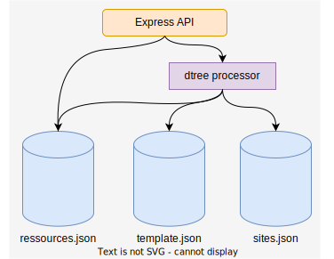
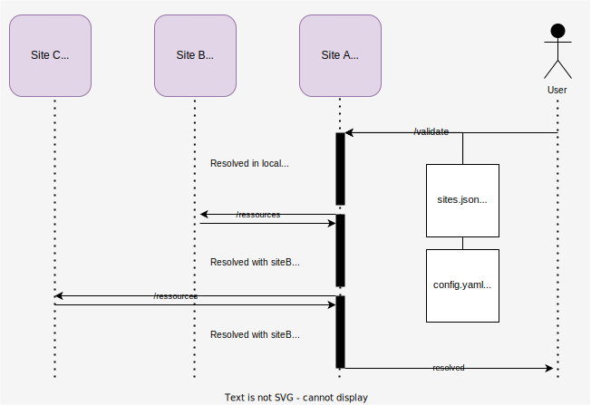

# dtree.js

*Identify relationships between resources in a geo-distributed microservices scenario.*

## Introduction

### Problematic

This project was realized during the research awareness course of the IMT Atlantic's software engineering program. 

"As part of generic approach to geo-distributed resources, a resource relationship model was introduced. In a micro-service scenario resources might be dependent to one another. These dependencies may be required at certain periods of time. Some need to be alive throughout the lifespan of the resources.

[...]

The objective is the development of the relationship model to identify various relationships of resources and creating a dependency tree to address this model when a CRUD operation is performed."[... complete pdf](docs/Cheops.pdf/)

### References

<a id="1">[1]</a>
Ronan-Alexandre Cherrueau, Marie Delavergne, Adrien Lebre. Geo-Distribute Cloud Applications at the Edge. EURO-PAR 2021 - 27th International European Conference on Parallel and Distributed Computing, Aug 2021, Lisbon, Portugal. pp.1-14, ff10.1007/978-3-030-85665-6_19ff. ffhal-03212421ff

<a id="2">[2]</a>
Marie Delavergne, Geo Johns Antony, Adrien Lebre. Cheops, a service to blow away Cloud applications to the Edge. [Research Report] RR-9486, Inria Rennes - Bretagne Atlantique. 2022, pp.1-16. ffhal-03770492v2ff

### Architecture



A **site** is a node located at a single location. 

* It has knowledge about its local resources in the `resources.json` database, and possibly the location of some remote resources.
* It also knows the format of the type of resources targeted by the experiment (e.g. kubernetes) in `template.json`.
* Finally, it relies on `sites.json` to determine which remote sites are accessible to it, and it can resolve their access path via their uri.

The express api exposes several services:
  
 * GET at `\ressources`: returns the resources present locally on the site (allows sites to communicate their resources to identify their availability and synchronize them in the network).
  
 * POST at `\verify`: returns the location of resources in the network. The user must provide in the body of the request a list of `sites` on which to base itself, as well as the `config` to complete.

   > **Body example for a verify request at `[site 1 url]\verify`**
   > ```
   > {
   >   sites: ["site2", "site3"],
   >   config: 
   >     "apiVersion: v1
   >     kind: Pod
   >     metadata:
   >       name: mypod
   >     spec:
   >       containers:
   >         - name: redis
   >           image: redis
   >           volumeMounts:
   >             - name: foo
   >               mountPath: '/etc/foo'
   >               readOnly: true
   >       volumes:
   >         - name: foo
   >           secret:
   >             secretName: mysecret
   >             optional: false"
   > }
   > ```
   > This request done to the `site1` will request it to complete for each value of the given config the locations in which this ressource is stored. It will in a first time search in it's local database, then query both `site2` and `site3` to fill the locations array (`origin`).
   >
   > This process will stop as soon as all resources are found, or if necessary, search all available remote sites (`origin` will be an empty array if the resource is not available on the specified sites network).

## Implementation

### Technological choices

> Why use javascript ?

Initially, we chose to take advantage of the kubernetes technology stack (golang, command line tool with [cobra](https://github.com/spf13/cobra)) and were able to carry out a summary implementation of the decision tree generation. You can find this implementation here: [go implementation of dtree](https://github.com/IMT-Atlantique-FIL-2020-2023/dtree).

We realized with this PoC that achieving genericity and robustness with the go language was going to require a lot of code and testing, which was beyond the scope of this implementation. We therefore chose to ensure a clearer code (without having to specify heavy go templates, or multiply data conformity tests) and a more robust solution by validating beforehand the templates of the resources.

The proposed solution is therefore based on technologies that are an industry standard for json tree exploration, both in terms of security and performance (see the comparative go/js benchmarkings).

**Technological stack: made with...**
 * [nodejs](https://github.com/nodejs/node): open-source, cross-platform JavaScript runtime environment.
 * [express](https://github.com/expressjs/express): minimalist web framework for Nodejs.
 * [ajv](https://github.com/ajv-validator/ajv): the fastest JSON validator for Node.js and browser.
 * [yaml](https://github.com/eemeli/yaml): json parsing is handled natively, provides an equivalence for yaml.

### Getting started

1. clone this project: `git clone `
2. fetch the dependancies: `cd dtree.js && npm install`
3. setup a .env file: `cp .env.example .env`
4. run a local server: `npm run start`

Or using Docker

1. sudo docker build . -t site
2. sudo docker compose up

### Test case



For testing the dependency tree there are 4 configurations in `\assets`. They are respectively used for:
*  [a simple pod](assets/config1.yaml)
*  [a complex pod](assets/config2.yaml)
*  [a deployment](assets/deployment.yaml)
*  [a service](assets/service.yaml)

The json files in `/resources` represent the database for site 1, site 2 and site 3. There is one for each site and they are linked with docker compose.

Making a post request to [localhost:5001/verify](localhost:5001/verify) with the site id and configuration in the body will resolve the dependency tree.

**Example of a resolved DT:**

```
[
    {
        "value": "redis",
        "path": "pod.spec.containers[0].name",
        "origin": []
    },
    {
        "value": "foo",
        "path": "pod.spec.containers[0].volumeMounts[0].name",
        "origin": [
            "site3"
        ]
    },
    {
        "value": "/etc/foo",
        "path": "pod.spec.containers[0].volumeMounts[0].mountPath",
        "origin": [
            "site3"
        ]
    },
    {
        "value": "foo",
        "path": "pod.spec.volumes[0].name",
        "origin": [
            "site2"
        ]
    },
    {
        "value": "mysecret",
        "path": "pod.spec.volumes[0].secret.secretName",
        "origin": [
            "site2"
        ]
    }
]
```