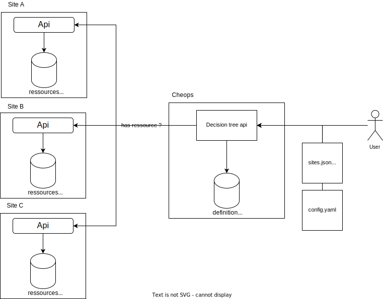

# dtree.js

*Identify relationships between resources in a geo-distributed microservices scenario.*

## Introduction

### Problematic

This project was realized during the research awareness course of the IMT Atlantic's software engineering program. 

"As part of generic approach to geo-distributed resources, a resource relationship model was introduced. In a micro-service scenario resources might be dependent to one another. These dependencies may be required at certain periods of time. Some need to be alive throughout the lifespan of the resources.

[...]

The objective is the development of the relationship model to identify various relationships of resources and creating a dependency tree to address this model when a CRUD operation is performed."[... complete pdf](docs/Cheops.pdf/)

### References

<a id="1">[1]</a>
Ronan-Alexandre Cherrueau, Marie Delavergne, Adrien Lebre. Geo-Distribute Cloud Applications at the Edge. EURO-PAR 2021 - 27th International European Conference on Parallel and Distributed Computing, Aug 2021, Lisbon, Portugal. pp.1-14, ff10.1007/978-3-030-85665-6_19ff. ffhal-03212421ff

<a id="2">[2]</a>
Marie Delavergne, Geo Johns Antony, Adrien Lebre. Cheops, a service to blow away Cloud applications to the Edge. [Research Report] RR-9486, Inria Rennes - Bretagne Atlantique. 2022, pp.1-16. ffhal-03770492v2ff

### Project

**SITES**
Sites knowledge
- local ressources
- other sites location
- some remote ressources

## Implementation

### Technological choices

> Why use javascript ?

Initially, we chose to take advantage of the kubernetes technology stack (golang, command line tool with [cobra](https://github.com/spf13/cobra)) and were able to carry out a summary implementation of the decision tree generation. You can find this implementation here: [go implementation of dtree](https://github.com/IMT-Atlantique-FIL-2020-2023/dtree).

We realized with this PoC that achieving genericity and robustness with the go language was going to require a lot of code and testing, which was beyond the scope of this implementation. We therefore chose to ensure a clearer code (without having to specify heavy go templates, or multiply data conformity tests) and a more robust solution by validating beforehand the templates of the resources.

The proposed solution is therefore based on technologies that are an industry standard for json tree exploration, both in terms of security and performance (see the comparative go/js benchmarkings).

**Technological stack: made with...**
 * [nodejs](): light and easy to use server
 * [express]():
 * [yaml](): json parsing is handled natively, this library provides an equivalence for the yaml format.
 * [ajv]():

### Getting started

1. clone this project: `git clone `
2. fetch the dependancies: `cd dtree.js && npm install`
3. setup a .env file: `cp .env.example .env`
4. run a local server: `npm run start`

### Test case

